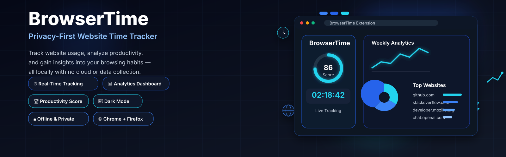

# BrowserTime
<p align="center">
  
</p>

<p>


</p>


<p align="center">
  
</p>

<p align="center">
  <strong>A modern, privacy-first browser extension that helps you understand how you spend your time online.</strong>
</p>

<p align="center">
  Track your browsing habits, analyze productivity, generate detailed reports, and gain insights into your daily web usage—all without sending any data to external servers.
</p>

---

## 📖 Table of Contents

- Overview
- Features
- Screenshots
- Technology Stack
- Architecture
- Installation
- Development
- Building
- Loading the Extension
- Packaging
- Project Structure
- Permissions
- Data Storage
- Browser Compatibility
- Troubleshooting
- Roadmap
- Contributing
- License

---

# Overview

**BrowserTime** is a fully offline browser extension designed to help users monitor and understand their browsing behavior.

Unlike many productivity extensions that rely on cloud synchronization or user accounts, BrowserTime stores **everything locally** using the browser's storage API. Your browsing statistics never leave your computer.

The extension continuously monitors your **active browser tab**, records how long you spend on each website, classifies websites into productivity categories, and presents the data through a beautiful analytics dashboard.

Whether you're a developer trying to reduce distractions, a student managing study time, or someone interested in digital wellbeing, BrowserTime provides meaningful insights into your online habits.

---

# ✨ Features

## ⏱️ Accurate Website Time Tracking

BrowserTime automatically records the amount of time spent on websites while ensuring only **active browsing time** is counted.

Features include:

- Automatic active tab detection
- Session-based tracking
- Background tracking
- Window focus detection
- Idle detection
- Automatic pause and resume
- Daily statistics
- Weekly statistics
- Domain-level aggregation

Tracking automatically pauses when:

- Browser loses focus
- Browser is minimized
- User becomes idle
- Active tab changes

---

## 📊 Analytics Dashboard

The extension includes a full analytics dashboard built with React.

Dashboard features include:

- Today's total browsing time
- Weekly browsing statistics
- Productivity score
- Current browsing session
- Most visited websites
- Longest browsing session
- Category distribution
- Weekly trend graphs
- Daily summaries

---

## 📈 Reports

Generate detailed reports showing:

- Daily activity
- Weekly activity
- Time distribution
- Most visited websites
- Productive vs distracting browsing
- Category breakdowns
- Average browsing duration
- Longest sessions

---

## 🧠 Productivity Score

BrowserTime automatically assigns websites into productivity categories.

Examples:

| Category | Examples |
|-----------|----------|
| Development | GitHub, GitLab, Stack Overflow, MDN |
| Learning | Coursera, Udemy, Khan Academy |
| Productivity | Notion, Google Docs, Jira |
| Social | Reddit, Facebook, Instagram |
| Entertainment | Netflix, Prime Video, YouTube |
| Communication | Slack, Discord, WhatsApp |

The productivity score is calculated using the time spent across these categories, helping users understand how efficiently they use their browsing time.

---

## 🔍 Search & History

Quickly search previous browsing activity.

Supported filters include:

- Website
- Domain
- Category
- Date
- Today
- Yesterday
- This Week
- Last 30 Days

---

## ⚙️ Settings

Customize BrowserTime to suit your workflow.

Available options:

- Dark Mode
- Light Mode
- Productive website list
- Distracting website list
- Export data
- Import data
- Reset statistics
- Notification preferences

---

## 🔒 Privacy First

Privacy is a core principle of BrowserTime.

The extension:

- ✅ Does not require an account
- ✅ Does not collect personal information
- ✅ Does not send analytics
- ✅ Does not use cloud storage
- ✅ Does not require an internet connection
- ✅ Stores all browsing data locally

Your browsing history never leaves your computer.

---

# 🖼 Screenshots

Add screenshots inside a folder named:

```
screenshots/
```

Recommended screenshots:

- Popup
- Dashboard
- Reports
- Dark Mode
- Weekly Analytics
- Settings

---

# 🛠 Technology Stack

## Frontend

- React 19
- TypeScript
- Vite
- Tailwind CSS
- Recharts
- Lucide React

## Browser APIs

- Tabs API
- Storage API
- Alarms API
- Idle API
- Runtime API
- Notifications API

## Build Tools

- Vite
- npm
- TypeScript

---

# 🏗 Architecture

```
Browser
│
├── Background Service
│      │
│      ├── Active Tab Tracking
│      ├── Session Manager
│      ├── Idle Detection
│      └── Storage Manager
│
├── Popup UI
│      │
│      ├── Current Session
│      ├── Daily Summary
│      └── Top Websites
│
├── Dashboard
│      │
│      ├── Reports
│      ├── Charts
│      ├── History
│      └── Settings
│
└── Browser Storage
```

---

# 📦 Requirements

- Node.js 18+
- npm 9+
- Chrome
- Firefox

Recommended:

- Node.js 20 LTS

---

# 🚀 Installation

Clone the repository:

```bash
git clone https://github.com/AdityaKarippadathUdai/BrowserTime.git
```

Move into the project:

```bash
cd BrowserTime
```

Install dependencies:

```bash
npm install
```

---

# 💻 Development

Start the Vite development server:

```bash
npm run dev
```

This starts the React dashboard for development.

---

# 🔨 Build

## Build Everything

```bash
npm run build
```

This automatically runs:

```bash
npm run build:chrome
npm run build:firefox
```

---

## Build Chrome

```bash
npm run build:chrome
```

Output:

```
chrome-dist/
```

---

## Build Firefox

```bash
npm run build:firefox
```

Output:

```
firefox-dist/
```

---

# 📦 Packaging

## Chrome

```bash
npm run zip
```

Produces:

```
chrome-extension.zip
```

---

## Firefox

Create an XPI package:

```bash
cd firefox-dist
zip -r ../BrowserTime.xpi .
```

Output:

```
BrowserTime.xpi
```

---

# 🌐 Load in Chrome

1. Open:

```
chrome://extensions
```

2. Enable **Developer Mode**

3. Click:

```
Load unpacked
```

4. Select:

```
chrome-dist/
```

5. Pin BrowserTime to the toolbar.

---

# 🦊 Load in Firefox

### Temporary Installation

Open:

```
about:debugging
```

Click:

```
This Firefox
```

Choose:

```
Load Temporary Add-on
```

Select:

```
firefox-dist/manifest.json
```

---

### Using the XPI

Simply drag:

```
BrowserTime.xpi
```

into Firefox or install it through the Add-ons interface (for signed builds).

---

# 📁 Project Structure

```
BrowserTime/
│
├── chrome-dist/
├── firefox-dist/
├── manifests/
├── public/
├── scripts/
├── src/
│   ├── background/
│   ├── components/
│   ├── constants/
│   ├── content/
│   ├── contexts/
│   ├── hooks/
│   ├── pages/
│   ├── popup/
│   ├── services/
│   ├── styles/
│   ├── types/
│   ├── utils/
│   ├── App.tsx
│   └── main.tsx
│
├── package.json
├── vite.config.ts
├── tsconfig.json
└── README.md
```

---

# 🔑 Required Browser Permissions

BrowserTime uses the following permissions:

| Permission | Purpose |
|------------|---------|
| tabs | Detect active websites |
| activeTab | Access active tab |
| storage | Save statistics locally |
| alarms | Periodic updates |
| idle | Pause tracking when idle |
| notifications | Productivity reminders |
| host_permissions | Access website URLs |

---

# 💾 Data Storage

All data is stored locally using the browser storage API.

Stored information includes:

- Website domain
- Page title
- Time spent
- Session duration
- Category
- Productivity score
- Daily statistics
- Weekly statistics
- User settings

No browsing data is uploaded to external servers.

---

# 🌍 Browser Compatibility

Supported browsers:

- ✅ Google Chrome
- ✅ Microsoft Edge
- ✅ Brave
- ✅ Opera
- ✅ Mozilla Firefox

The project maintains separate build configurations for Chrome and Firefox while sharing the same React codebase.

---

# ❓ Troubleshooting

## Extension Doesn't Track Time

- Ensure the extension is enabled.
- Refresh the current website.
- Confirm required permissions are granted.
- Check that the site isn't a restricted browser page.

---

## Extension Doesn't Load

- Verify the correct build folder was selected.
- Ensure `manifest.json` exists.
- Reload the extension.

---

## Build Errors

Clean and reinstall dependencies:

```bash
rm -rf node_modules package-lock.json
npm install
```

Then rebuild:

```bash
npm run build
```

---

# 🗺 Roadmap

Planned features:

- Cloud sync (optional)
- Pomodoro timer
- Focus mode
- Weekly email reports (optional)
- Data visualization improvements
- Website blocking
- Goal tracking
- Time limits
- Cross-device synchronization (optional)
- Import from other time trackers

---

# 🤝 Contributing

Contributions are welcome!

1. Fork the repository.
2. Create a new feature branch.
3. Commit your changes.
4. Push to your fork.
5. Open a Pull Request.

Please follow the existing project structure and coding style.

---

# 📄 License

This project is licensed under the **MIT License**.

See the [LICENSE](LICENSE) file for more information.

